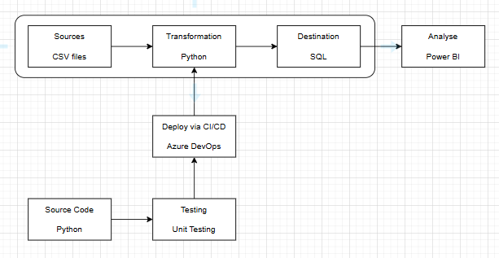

# DE5-M5

## Solution Step By Step

- The raw data is stored in CSV files.
- Use Python to import the data.
- Transform and clean the data using Pandas library and functions.
- Test the functions using Unittest.
- Write the data to an SQL database.
- Connect to the data in the database and analyse using Power BI.

## Architectural Diagram

The proposed solution for MVP:

## Kanban Board

